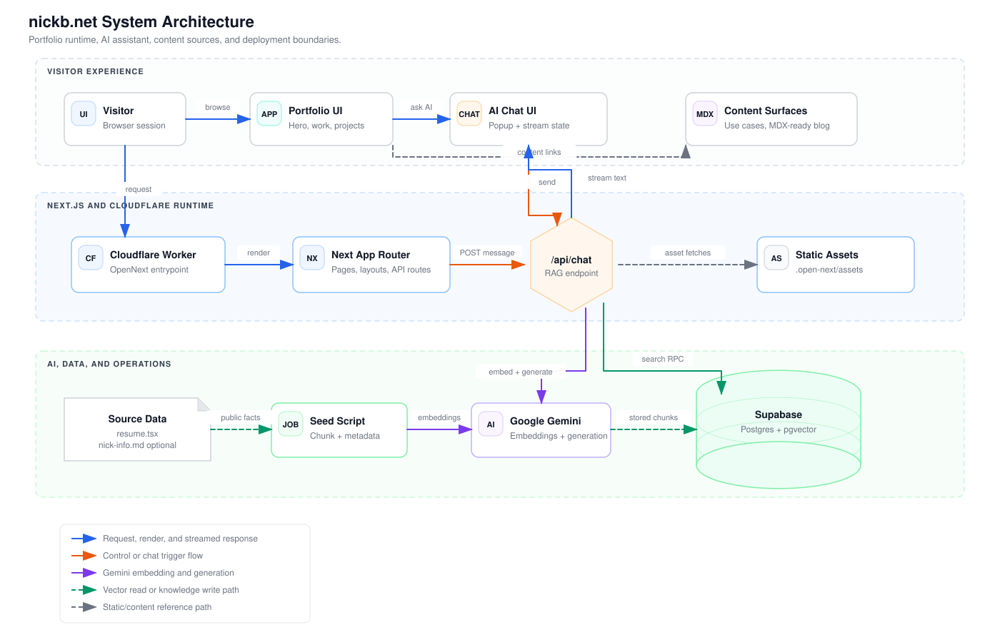
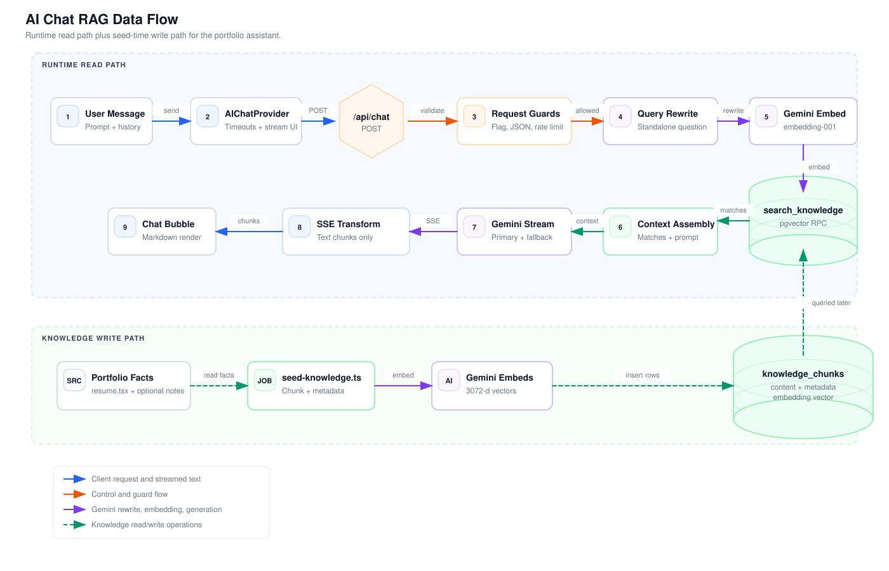

# nickb.net

Personal portfolio and interactive AI-powered website for **Nick Bohmer** — Product Leader & AI Builder based in Dallas, TX.

Built with Next.js 16, React 19, and TypeScript. Features an AI chat assistant powered by RAG (Retrieval-Augmented Generation) with a Supabase vector database backend.

## Features

- **AI Chat Assistant** — Interactive chatbot with streaming responses, powered by Gemini embeddings and semantic search over a curated knowledge base (Supabase + pgvector)
- **Project Showcase** — Highlighted builds including [polymorph](https://polymorph.fyi), [vana.bot](https://vana.bot), and AnalystAI
- **Work Experience Timeline** — Career progression with role details and accomplishments
- **Blog System** — MDX-ready blog pipeline with syntax highlighting, GitHub Flavored Markdown, and content collections
- **Use Cases** — BreeziNet case study content plus use-case card metadata
- **Dark/Light Theme** — System-aware theme switching with smooth transitions
- **Animations** — Blur fade effects, flickering grid backgrounds, and animated UI elements via `motion`

## Tech Stack

| Layer | Technology |
|-------|-----------|
| Framework | [Next.js 16](https://nextjs.org) (App Router) |
| UI | [React 19](https://react.dev), [TypeScript](https://typescriptlang.org) |
| Styling | [Tailwind CSS 4](https://tailwindcss.com), [shadcn/ui](https://ui.shadcn.com), [Radix UI](https://radix-ui.com) |
| Animation | [`motion`](https://motion.dev), custom Magic UI components |
| Content | [MDX](https://mdxjs.com) via [content-collections](https://content-collections.dev) |
| Database | [Supabase](https://supabase.com) (PostgreSQL + pgvector) |
| AI/Embeddings | Google Gemini API (embeddings + generation) |
| Deployment | [Cloudflare Workers](https://workers.cloudflare.com) via OpenNext |

## Project Structure

```
src/
├── app/                    # Next.js App Router pages & API routes
│   ├── api/chat/           # AI chat streaming text endpoint
│   ├── blog/               # Blog listing & individual post pages
│   └── use-cases/          # Case study pages
├── components/
│   ├── section/            # Page sections (projects, work, contact, use cases)
│   ├── magicui/            # Animation components (blur-fade, flickering-grid, dock)
│   ├── ui/                 # shadcn/ui components + AI chat + SVG icons
│   └── mdx/                # MDX rendering components
├── data/
│   └── resume.tsx          # Centralized portfolio list data (work, projects, contact, use-case cards)
├── hooks/                  # Custom React hooks
└── lib/                    # Utilities, Supabase client, pagination
content/                    # Optional MDX blog posts when present
scripts/                    # Knowledge base seeding & verification
supabase/                   # Database migrations
```

## Architecture

The main runtime runs as a Next.js App Router application deployed to Cloudflare Workers through OpenNext. The portfolio UI, content routes, static assets, AI chat UI, `/api/chat` endpoint, Gemini APIs, and Supabase vector store are split across the boundaries shown below.



For more detail, see [docs/architecture.md](docs/architecture.md).

## Getting Started

### Prerequisites

- Node.js 18+
- A [Supabase](https://supabase.com) project with the pgvector extension enabled
- Google Gemini API key (for AI chat functionality)

### Setup

1. **Clone the repository**

   ```bash
   git clone https://github.com/NickB03/portfolio.git
   cd portfolio
   ```

2. **Install dependencies**

   ```bash
   npm install
   ```

3. **Configure environment variables**

   Copy the example env file and fill in your values:

   ```bash
   cp .env.example .env.local
   ```

   Required variables:
   - `NEXT_PUBLIC_SUPABASE_URL` — Supabase project URL
   - `NEXT_PUBLIC_SUPABASE_ANON_KEY` — Supabase anonymous key
   - `SUPABASE_SERVICE_ROLE_KEY` — Supabase service role key
   - `GEMINI_API_KEY` — Google Gemini API key for embeddings and responses
   - `ENABLE_AI_CHAT` — Server-side flag that enables the `/api/chat` endpoint
   - `NEXT_PUBLIC_ENABLE_AI_CHAT` — Client-side flag that shows the AI chat UI

4. **Seed the knowledge base** (optional, for AI chat)

   ```bash
   npx tsx scripts/seed-knowledge.ts
   ```

5. **Start the development server**

   ```bash
   npm run dev
   ```

   Open [http://localhost:3000](http://localhost:3000).

### Build

```bash
npm run build
```

### Deploy

Configured for Cloudflare Workers through OpenNext. Preview the Worker locally:

```bash
npm run preview
```

Deploy with:

```bash
npm run deploy
```

The non-secret Worker flags live in `wrangler.json`. Keep `SUPABASE_SERVICE_ROLE_KEY` and `GEMINI_API_KEY` configured as Cloudflare Worker secrets before deploying.

## AI Chat Architecture

The AI chat assistant uses a RAG pipeline:



1. **Client request** sends the latest message plus capped chat history from the AI chat provider to `/api/chat`
2. **Request guards** enforce the feature flag, JSON validation, message validation, and in-memory IP rate limiting
3. **Query rewrite and embedding** use Gemini to turn follow-up messages into standalone questions and embed the search query
4. **Semantic search** calls the Supabase `search_knowledge` RPC over `knowledge_chunks.embedding`
5. **Context assembly** combines the top matches with the system prompt and current conversation
6. **Response generation** streams Gemini output back to the client as plain text chunks

The knowledge base is seeded from public-safe resume/project data by default, with optional `nick-info.md` chunks when `INCLUDE_PERSONAL_KNOWLEDGE=true`, and stored as vector embeddings in Supabase for fast retrieval.

## License

This is a personal portfolio project. Source code is available for reference and learning purposes.
